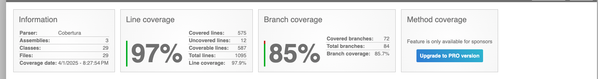

# Currency Converter API

## Overview

The **Currency Converter API** allows users to:
- Retrieve the latest exchange rates.
- Convert currencies.
- Access historical exchange rates for a given period.

The API implements security and performance features like **JWT authentication**, **rate-limiting**, **caching**, **retry policies**, and **structured logging**. It is designed with **Clean Architecture principles** to ensure scalability and maintainability. The API integrates external services (i.e Frankfurter API for exchange rates) and is configured for future enhancements, including **CI/CD deployment readiness** and **AWS scaling considerations**.

Additionally, the API uses the **Factory Design Pattern** to support the integration of future exchange rate providers with minimal changes to the existing codebase.

## Features

1. **Retrieve Latest Exchange Rates**: Fetch the latest exchange rates for a specified base currency.
2. **Currency Conversion**: Convert amounts between different currencies, excluding certain currencies like `TRY`, `PLN`, `THB`, and `MXN`.
3. **Historical Exchange Rates**: Retrieve historical exchange rates for a specified date range with pagination.

## Prerequisites

1. **.NET 8 SDK**: Ensure you have the latest .NET 8 SDK installed on your machine. You can download it from the [official .NET website](https://dotnet.microsoft.com/download).
2. **Redis**: If you want to run the app locally, you need to have Redis installed. You can download Redis from the [Redis website](https://redis.io/download), or you can run it in a Docker container using the following command:
   ```bash
   docker run -p 6379:6379 redis
   ```
3. **Seq**: For structured logging, ensure Seq is running on `http://localhost:5341`. You can download Seq from [here](https://datalust.co/seq).
4. **Zipkin**: For distributed tracing, ensure Zipkin is running locally. You can start it using Docker:
   ```bash
   docker run -d -p 9411:9411 openzipkin/zipkin
   ```

## Setup Instructions

### 1. Clone the Repository

```bash
git clone https://github.com/Uzair-Arif/CurrencyConverterAPI.git
cd currency-converter-api
```

### 2. Install Dependencies

Run the following command to restore the NuGet packages:

```bash
dotnet restore
```

### 3. Run the Application

Run the following command to start the API:

```bash
dotnet run
```

This will start the API on `http://localhost:5000` (or the configured address in `appsettings.json`). You can now make API requests to this endpoint.

## Configuration

The application’s settings are defined in `appsettings.json`. Below is an example configuration:

```json
{
  "Logging": {
    "LogLevel": {
      "Default": "Information",
      "Microsoft.AspNetCore": "Warning"
    }
  },
  "JwtSettings": {
    "Secret": "SuperStrongSecretKeyThatIsAtLeast32CharactersLong!",
    "Issuer": "CurrencyConverterAPI",
    "Audience": "CurrencyConverterClients",
    "TokenExpiryMinutes": 60
  },
  "Redis": {
    "ConnectionString": "localhost:6379",
    "InstanceName": "CurrencyConverter:"
  }
}
```

## Test Coverage

The test coverage report can be found under the following directory:

```
/CurrencyConverterAPI/tests/CurrencyConverter.Tests/TestResults/CoverageReport/index.html
```

Open the `index.html` file in this directory to view the detailed test coverage report in your browser.

Below is a screenshot of the current test coverage



## Assumptions

1. **Historical Rates Caching**: Historical rates fetching has not been cached because it depends on date selection, and dates can vary significantly. Caching such responses is not performance-efficient. However, we may monitor such scenarios and introduce caching later if needed.
2. **In-Memory Authentication**: In-memory username and password have been used for now to demonstrate JWT authentication. This approach needs better handling, such as implementing **ASP.NET Identity** for production-grade applications.

## Future Enhancements

1. **Database Integration**: Implement a database for storing user data (e.g. ASP.NET Identity).
2. **CI/CD Implementation**: Complete the CI/CD pipelines for automatic deployment and scaling on AWS.
3. **Test Refactoring**: Refactor unit and integration tests for improved maintainability and coverage.
4. **Additional Providers**: Integrate other exchange rate providers for flexibility.
5. **Swagger Examples**: Add detailed Swagger examples for all API endpoints to improve developer experience and provide interactive API documentation.
6. **Standard API Response Model**: Create a consistent API response structure (e.g., a `BaseModel`) to ensure uniformity across all endpoints, making it easier for developers to work with and understand the API.